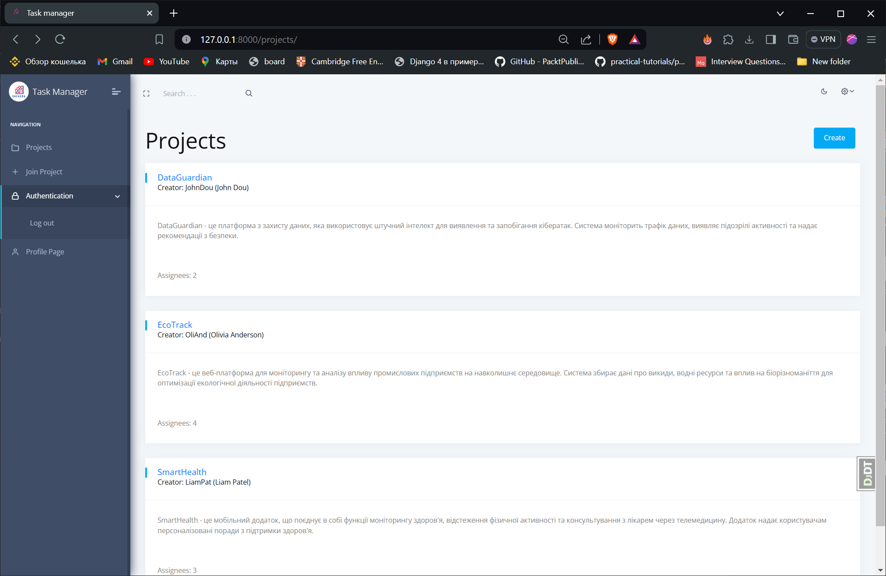

# Task manager

Task management tool designed to streamline team workflow and enhance productivity.

## Check it out!

[Library project deployed to Render](https://task-manager-u2b4.onrender.com)

## Installation

Python3 must be already installed

```shell
git clone https://github.com/kapitoshk4/task-manager.git
cd task-manager
python3 -m venv venv
source venv/scripts/activate
pip install -r requirements.txt
python manage.py runserver
```

## Features

* Authentication functionality for Worker/User.
* Project Management:
  * Create, edit, and delete projects.
  * Generate invitation codes to invite team members to projects.
* Task Management:
  * Create, edit & delete tasks within projects.
* Communication Tools:
  * Each project includes a chat feature for team communication.
  * Each task has a comment section for detailed discussions and updates.

## Demo

